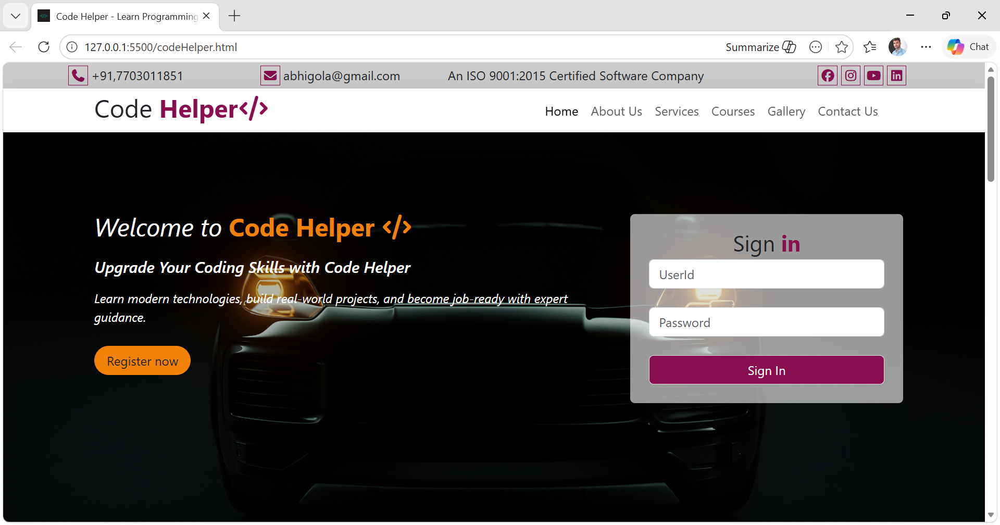
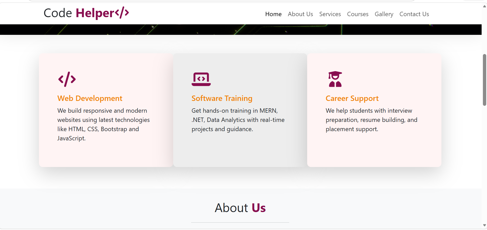
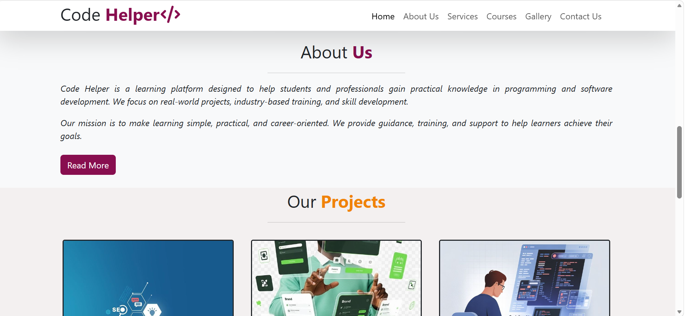
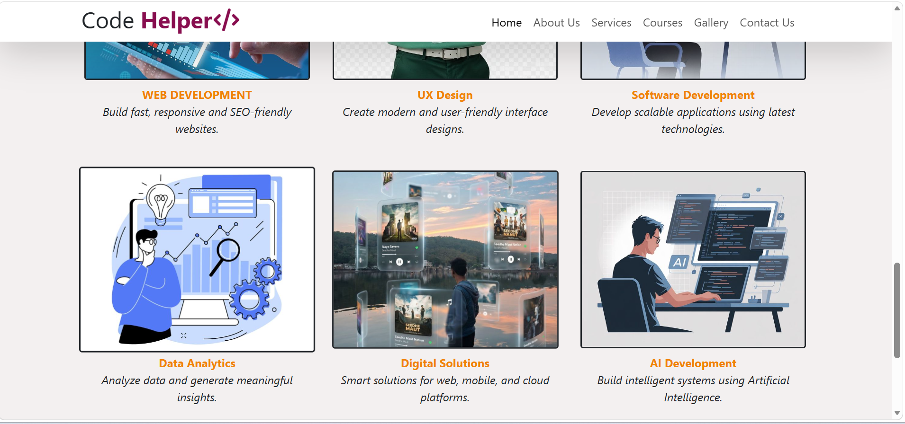

# 💻 Code Helper

A modern and responsive website designed to help students learn programming and build real-world projects.

---

## 🚀 Features
- Responsive design using Bootstrap
- Attractive homepage with slider
- Services section
- About Us section
- Projects / Gallery section
- Contact & Footer section

---

## 🛠️ Technologies Used
- HTML5
- CSS3
- Bootstrap
- Font Awesome

---

## 📸 Screenshots

### 🏠 Home / Slider

### 🛠 Services

### 📖 About Us

### 💻 Projects

### 📞 Footer

---

## 👨‍💻 Author
Abhishek Chakravarti

---

## 📌 Note
This is a frontend project created for learning and portfolio purposes.
